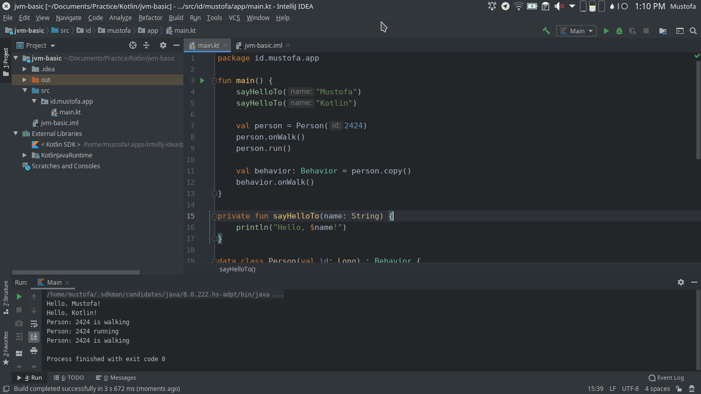

# Breeze Dark
Breeze Dark Theme for Intellij IDEA to match with KDE Plasma default look and feel. Download [Plugin](https://plugins.jetbrains.com/plugin/13224-breeze-dark/).

* [KDE Logo](https://kde.org/stuff/clipart.php)
* [Breeze Theme](https://github.com/KDE/breeze)
* [Creating Custom UI Themes](https://www.jetbrains.org/intellij/sdk/docs/reference_guide/ui_themes/themes.html)
